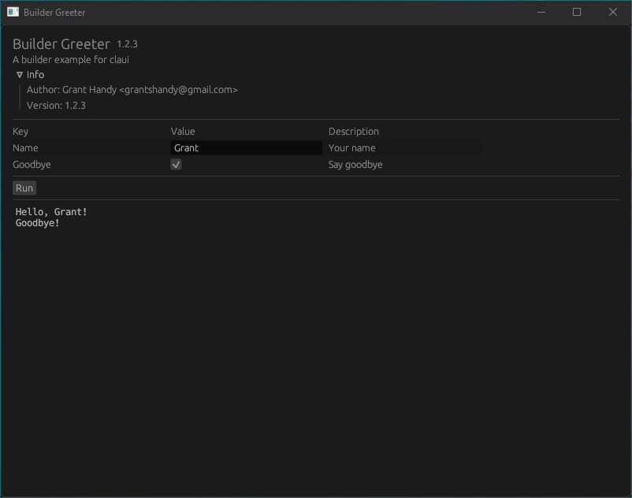
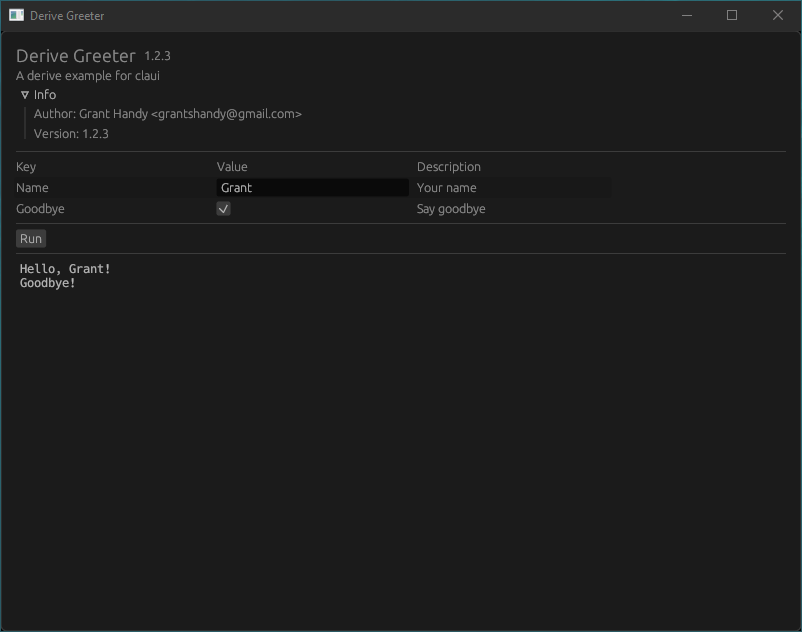

# clui
A GUI generator for [`clap-rs`](https://github.com/clap-rs/clap) using [`egui`](https://github.com/emilk/egui).

## Builder Example
```rust
use clap::{arg, Command};

fn main() {
    let app = Command::new("Builder Greeter")
        .author("Grant Handy <grantshandy@gmail.com>")
        .version("1.2.3")
        .about("A builder example for clui")
        .arg(arg!(-n --name "Your name").default_value("Joe"))
        .arg(arg!(-g --goodbye "Say goodbye"));

    clui::run(app, |matches| {
        println!("Hello, {}!", matches.value_of("name").unwrap());

        if matches.is_present("goodbye") {
            println!("Goodbye!");
        }
    });
}
```


## Derive Example
```rust
use clap::{CommandFactory, Parser};

#[derive(Parser, Debug)]
#[clap(
    name = "Derive Greeter",
    author = "Grant Handy <grantshandy@gmail.com>",
    version = "1.2.3",
    about = "A derive example for clui"
)]
struct Args {
    #[clap(short, long, default_value = "Joe", help = "Your name")]
    name: String,
    #[clap(short, long, help = "Say goodbye")]
    goodbye: bool,
}

fn main() {
    let app = Args::command();

    clui::run(app, |matches| {
        println!("Hello, {}!", matches.value_of("name").unwrap());

        if matches.is_present("goodbye") {
            println!("Goodbye!");
        }
    });
}
```


## Comparison with [`klask`](https://github.com/MichalGniadek/klask)
Klask is another GUI generator for [`clap`](https://github.com/clap-rs/clap) that uses [`egui`](https://github.com/emilk/egui), but clui and klask work in different ways. Klask runs your code by running itself as a child with an environment variable to ignore its GUI, then capturing the child stdout. Clui only runs one process; it spawns your code in another thread and then reroutes all of your stdout into a buffer through [`shh`](https://github.com/kurtlawrence/shh).